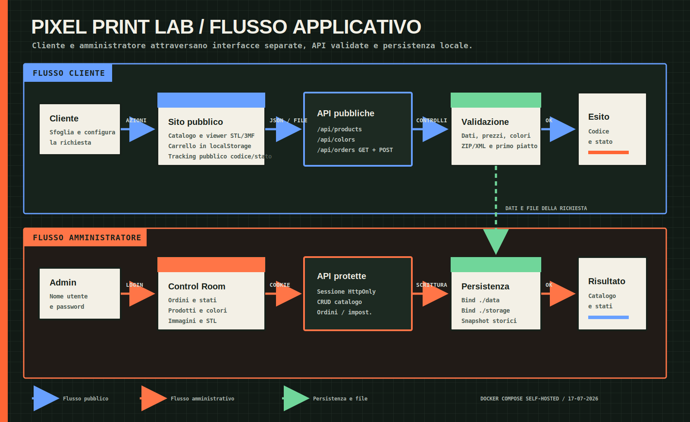
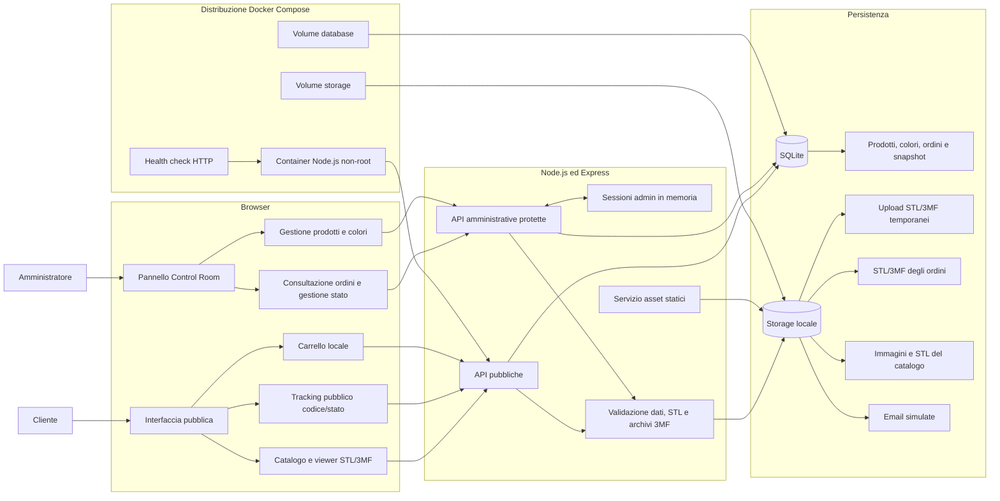
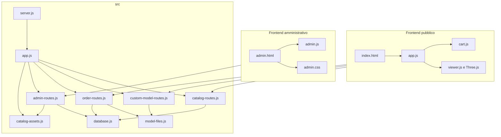
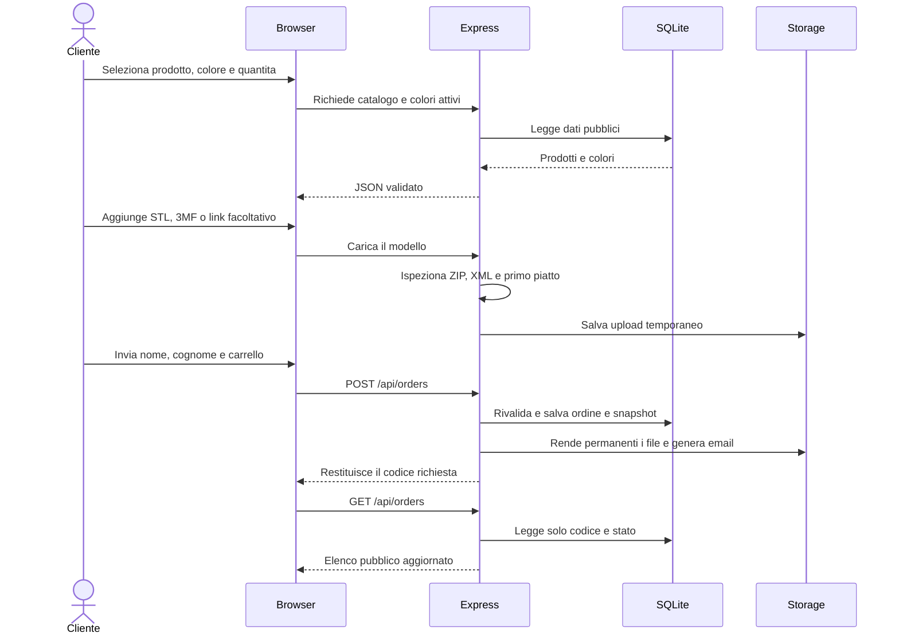
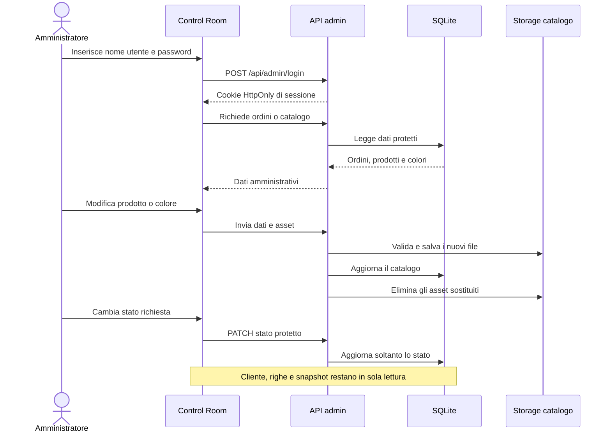

# Architettura Di Pixel Print Lab

Questo documento rappresenta la struttura generale dell'applicazione. Deve essere aggiornato insieme al codice quando cambiano componenti, dipendenze, API, database, directory di storage o flussi principali.

Ultimo aggiornamento: 17 luglio 2026, release GitHub e immagini GHCR.

## Diagramma Di Flusso



Il file SVG puo essere aperto direttamente dal percorso [`docs/images/flusso-applicazione.svg`](images/flusso-applicazione.svg) e mantiene la qualita a qualsiasi dimensione.

## Vista Generale



## Componenti Applicativi



## Flusso Di Una Richiesta



## Flusso Amministrativo



## Mappa Delle Directory

```text
Pixel Print Lab/
|-- public/                 Interfacce e asset inclusi nel progetto
|   |-- index.html          Pagina pubblica
|   |-- app.js              Catalogo e modelli personali
|   |-- cart.js             Stato e regole del carrello
|   |-- viewer.js           Anteprima STL/3MF con Three.js
|   |-- admin.html          Control Room
|   |-- admin.js            Ordini, prodotti e colori
|   `-- images/ e models/   Asset dimostrativi
|-- src/                    Server e regole applicative
|   |-- server.js           Avvio e configurazione ambiente
|   |-- app.js              Composizione Express
|   |-- database.js         Migrazioni e seed SQLite
|   |-- catalog-routes.js   API pubbliche del catalogo
|   |-- custom-model-routes.js
|   |-- model-files.js      Ispezione sicura STL/3MF e primo piatto
|   |-- order-routes.js
|   |-- admin-routes.js     Sessioni e API protette
|   `-- catalog-assets.js   Upload e servizio asset catalogo
|-- storage/                File runtime esclusi da Git
|   |-- uploads/            STL/3MF temporanei
|   |-- orders/             STL/3MF permanenti degli ordini
|   |-- catalog/            Immagini e STL amministrativi
|   `-- emails/             Email simulate
|-- data/                   Database SQLite runtime
|-- test/                   Test automatici
|-- docs/                   Roadmap, guida, esercizi e diagrammi
|-- .github/workflows/      Test continui e pubblicazione release
|-- Dockerfile              Immagine di produzione Node.js 22
|-- compose.yml             Servizio, configurazione, health check e volumi
|-- .dockerignore           Esclusioni dal contesto di build
|-- CHANGELOG.md            Modifiche delle versioni pubblicate
|-- LICENSE                 Licenza MIT
|-- .env                    Configurazione locale esclusa da Git
`-- package.json            Script e dipendenze
```

## Distribuzione Docker

- Il container esegue migrazioni e seed idempotente prima di avviare il server.
- Il processo applicativo usa l'utente non privilegiato `node` e un filesystem in sola lettura.
- SQLite risiede nel volume `database`; upload, ordini, catalogo ed email simulate risiedono nel volume `storage`.
- Le variabili di Compose possono arrivare dal file `.env` o dall'ambiente dell'host; la password predefinita `admin` va sostituita prima dell'esposizione in rete.
- Il health check interroga `/api/health` sulla porta interna configurata.
- Una singola istanza applicativa deve usare il database SQLite; i volumi non vanno condivisi tra repliche concorrenti.
- I tag `v*.*.*` verificano l'applicazione, pubblicano l'immagine versionata su GHCR e creano una GitHub Release.
- Le immagini ricevono il numero completo, il numero major/minor e `latest`; i dati runtime non fanno parte dell'immagine.

## Confini Di Sicurezza

- Le pagine statiche non contengono dati amministrativi.
- Tutte le API `/api/admin/*` richiedono una sessione valida.
- Le credenziali sono lette da `.env`, che e escluso da Git.
- I dati inviati dal browser vengono rivalidati dal server.
- Gli upload usano nomi UUID, limiti di dimensione e verifica del contenuto.
- I 3MF vengono ispezionati lato server prima dell'anteprima e confrontati con un volume standard 256x256x256 mm.
- I file degli ordini sono accessibili soltanto tramite API protette.
- Gli asset del catalogo sono pubblici, ma possono essere caricati soltanto dall'amministratore.
- Gli ordini conservano snapshot indipendenti dalle modifiche al catalogo.
- Il pannello non espone API per modificare cliente o righe; consente soltanto stato e cancellazione dell'ordine.
- Il tracking pubblico espone soltanto codice completo e stato; il codice e un identificatore pubblico, non un segreto.

## Regola Di Manutenzione

Questo documento fa parte della definizione di completamento del progetto. Una modifica strutturale non e conclusa finche non sono aggiornati:

1. i diagrammi interessati;
2. la mappa delle directory, se cambia;
3. la data e la fase indicate in apertura;
4. i riferimenti nella guida tecnica e nella roadmap.
